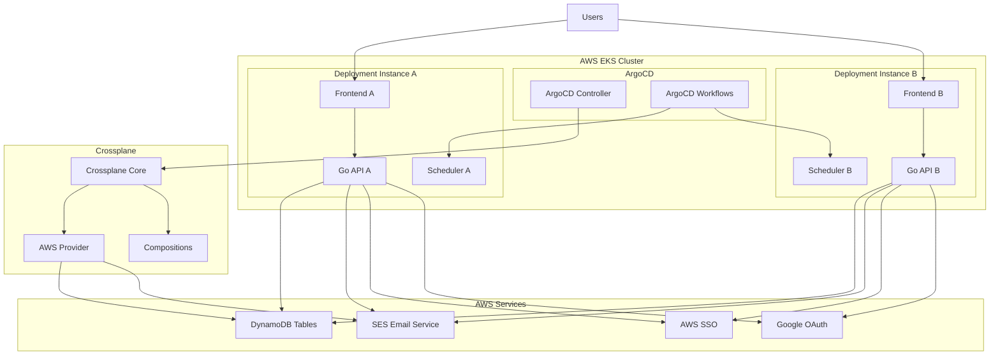
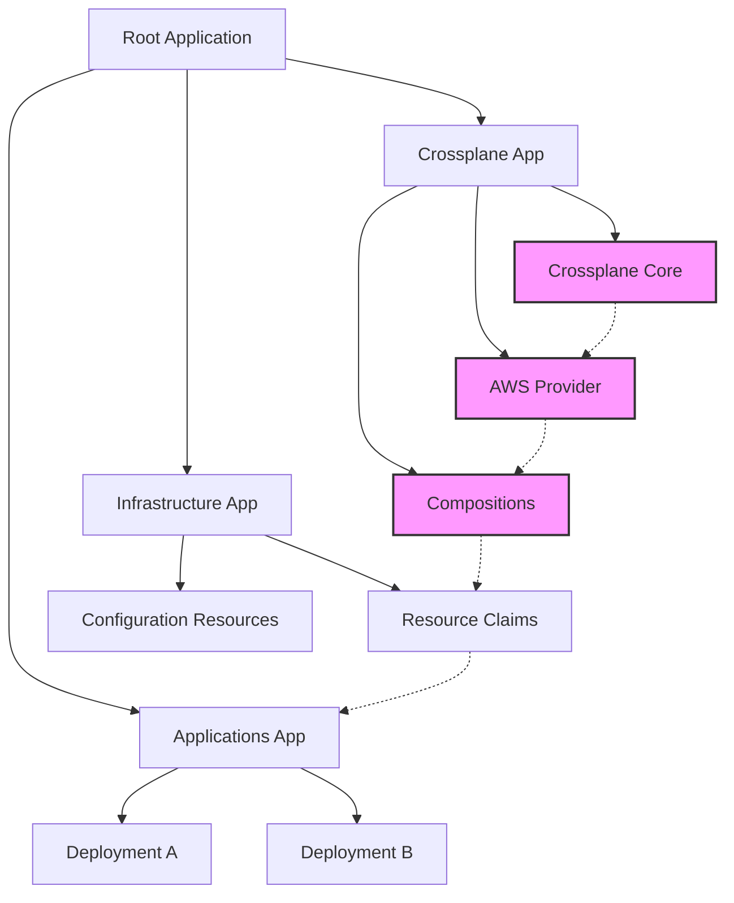
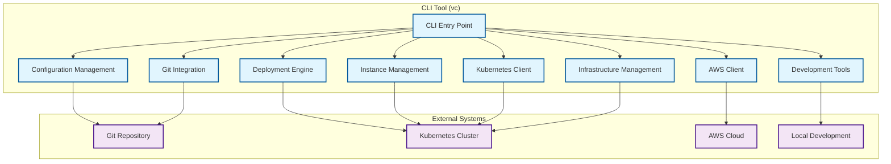

# Design Document

## Overview

The Virtual Coffee Platform is designed as a cloud-native, multi-tenant application deployed on AWS EKS using GitOps principles. The architecture follows microservices patterns with clear separation between the Go-based backend API, frontend interface, and supporting AWS infrastructure components.

### Key Design Principles

- **Multi-tenancy**: Complete isolation between different team/office deployments
- **Cloud-native**: Kubernetes-first design leveraging AWS EKS capabilities
- **GitOps**: All infrastructure and application deployments managed through ArgoCD
- **Security**: Federated authentication with corporate SSO and Google integration
- **Scalability**: Horizontal scaling capabilities for multiple concurrent deployments
- **Simplicity**: Minimal complexity for MVP while maintaining extensibility

## Architecture

### High-Level Architecture



### Deployment Architecture

Each virtual coffee deployment consists of:

1. **Frontend Application**: Simple web interface for user interactions
2. **Backend API**: Go-based REST API handling business logic
3. **Scheduler Component**: Handles matching algorithm execution
4. **Dedicated AWS Resources**: Isolated DynamoDB tables and SES configuration
5. **ArgoCD Workflow**: Manages scheduled matching operations

## Components and Interfaces

### Frontend Application

**Technology**:
- React.js with TypeScript for type safety and developer experience
- AWS Cloudscape Design System for UI components and layout

**Key Features**:
- User registration and profile management using Cloudscape forms and input components
- Preference configuration interface with Cloudscape form components
- Participation toggle (pause/resume) using Cloudscape toggle components
- Match notification display with Cloudscape cards and status indicators
- AWS-like navigation experience with Cloudscape side navigation
- Responsive design using Cloudscape responsive layout components

**Cloudscape Components**:
- AppLayout for consistent application structure
- SideNavigation for menu navigation
- Table for displaying matches and history
- Cards for user profile and match information
- Form components for user preferences
- Alert components for notifications and errors
- Modal dialogs for confirmations
- Buttons and form controls for user interactions

**API Integration**:
- RESTful API calls to Python FastAPI backend
- JWT token-based authentication
- Status indicators for loading states and errors

### Backend Architecture

The backend uses a hybrid approach with Go for core API services and FastAPI (Python) for business logic implementation:

**Go API Layer**:
- HTTP routing and middleware using Gin framework
- Authentication and session management
- Request validation and error handling
- API endpoint implementation
- Service coordination

**Python Business Logic (FastAPI)**:
- Matching algorithm implementation
- Data analysis and processing
- Complex business rules
- Preference processing
- Exposed as internal microservice

**Core Modules**:

1. **Authentication Service (Go)**
   - Federated authentication with AWS SSO and Google OAuth
   - JWT token generation and validation
   - Session management

2. **User Service (Go)**
   - User registration and profile management
   - Preference storage and retrieval
   - Participation status management

3. **Matching Service (Python/FastAPI)**
   - Random matching algorithm implementation
   - Historical pairing tracking to avoid recent matches
   - Configurable meeting size support
   - Exposed as internal API consumed by Go services

4. **Notification Service (Go)**
   - Email template management
   - SES integration for email delivery
   - Support for multiple notification channels (email, Slack, Telegram, Signal)
   - Channel preference management
   - Retry logic and fallback mechanisms

5. **Configuration Service (Go)**
   - Deployment-specific configuration management
   - Schedule configuration
   - Time zone handling

**API Endpoints**:

```
Authentication:
POST /auth/login
POST /auth/logout
GET  /auth/me

Users:
POST /users/register
GET  /users/profile
PUT  /users/profile
PUT  /users/preferences
PUT  /users/participation

Matches:
GET  /matches/current
GET  /matches/history
POST /matches/feedback

Admin (Future):
GET  /admin/users
GET  /admin/stats
```

### Scheduler Component

**Implementation**: Kubernetes CronJob triggered by ArgoCD Workflows

**Functionality**:
- Executes matching algorithm on configured schedule
- Handles time zone calculations per deployment
- Triggers notification service after successful matching
- Logs execution results for monitoring

### AWS Infrastructure Components

**Infrastructure Deployment Approach**:
All AWS resources managed through Crossplane via ArgoCD:

1. **Crossplane AWS Provider**:
   - DynamoDB tables and indexes
   - SES configurations and identities
   - Lambda functions and event sources
   - IAM roles and policies
   - Managed through GitOps workflow with ArgoCD

2. **Crossplane Compositions**:
   - High-level abstractions for deployment resources
   - Encapsulation of complex resource orchestration
   - Cross-resource dependencies management
   - Deployment-specific configurations
   - Reusable templates for multi-tenant deployments

**AWS Resources**:

**DynamoDB Tables** (per deployment):
- `users-{deployment-id}`: User profiles and preferences
- `matches-{deployment-id}`: Match history and current matches
- `config-{deployment-id}`: Deployment configuration

**Lambda Functions**:
- `matching-{deployment-id}`: Executes the matching algorithm
- `notification-{deployment-id}`: Handles email delivery
- `cleanup-{deployment-id}`: Periodic data maintenance

**SES Configuration** (per deployment):
- Dedicated email templates
- Sender identity configuration
- Bounce and complaint handling

**Aurora Serverless** (optional alternative to DynamoDB):
- Relational data storage for complex queries
- Auto-scaling based on demand
- Isolated per deployment

**IAM Roles**:
- EKS service roles with minimal required permissions
- Lambda execution roles with specific permissions
- Cross-service access policies for resource access

## Data Models

### User Model

```go
type User struct {
    ID              string    `json:"id" dynamodb:"id"`
    Email           string    `json:"email" dynamodb:"email"`
    Name            string    `json:"name" dynamodb:"name"`
    DeploymentID    string    `json:"deployment_id" dynamodb:"deployment_id"`
    Preferences     Preferences `json:"preferences" dynamodb:"preferences"`
    NotificationPrefs NotificationPreferences `json:"notification_prefs" dynamodb:"notification_prefs"`
    IsActive        bool      `json:"is_active" dynamodb:"is_active"`
    IsPaused        bool      `json:"is_paused" dynamodb:"is_paused"`
    CreatedAt       time.Time `json:"created_at" dynamodb:"created_at"`
    UpdatedAt       time.Time `json:"updated_at" dynamodb:"updated_at"`
}

type Preferences struct {
    Availability    []string  `json:"availability" dynamodb:"availability"`
    Topics          []string  `json:"topics" dynamodb:"topics"`
    MeetingLength   int       `json:"meeting_length" dynamodb:"meeting_length"`
}

type NotificationPreferences struct {
    Email           bool      `json:"email" dynamodb:"email"`
    Slack           bool      `json:"slack" dynamodb:"slack"`
    SlackWebhook    string    `json:"slack_webhook,omitempty" dynamodb:"slack_webhook,omitempty"`
    Telegram        bool      `json:"telegram" dynamodb:"telegram"`
    TelegramChatID  string    `json:"telegram_chat_id,omitempty" dynamodb:"telegram_chat_id,omitempty"`
    Signal          bool      `json:"signal" dynamodb:"signal"`
    SignalNumber    string    `json:"signal_number,omitempty" dynamodb:"signal_number,omitempty"`
    PrimaryChannel  string    `json:"primary_channel" dynamodb:"primary_channel"`
}
```

### Match Model

```go
type Match struct {
    ID              string    `json:"id" dynamodb:"id"`
    DeploymentID    string    `json:"deployment_id" dynamodb:"deployment_id"`
    Participants    []string  `json:"participants" dynamodb:"participants"`
    ScheduledDate   time.Time `json:"scheduled_date" dynamodb:"scheduled_date"`
    Status          string    `json:"status" dynamodb:"status"`
    CreatedAt       time.Time `json:"created_at" dynamodb:"created_at"`
    NotificationSent bool     `json:"notification_sent" dynamodb:"notification_sent"`
}
```

### Configuration Model

```go
type DeploymentConfig struct {
    DeploymentID    string    `json:"deployment_id" dynamodb:"deployment_id"`
    Schedule        string    `json:"schedule" dynamodb:"schedule"`
    TimeZone        string    `json:"timezone" dynamodb:"timezone"`
    MeetingSize     int       `json:"meeting_size" dynamodb:"meeting_size"`
    AdminEmails     []string  `json:"admin_emails" dynamodb:"admin_emails"`
    EmailTemplates  EmailTemplates `json:"email_templates" dynamodb:"email_templates"`
    CreatedAt       time.Time `json:"created_at" dynamodb:"created_at"`
    UpdatedAt       time.Time `json:"updated_at" dynamodb:"updated_at"`
}
```

## Error Handling

### API Error Responses

Standardized error response format:

```go
type ErrorResponse struct {
    Error   string `json:"error"`
    Code    int    `json:"code"`
    Message string `json:"message"`
    Details map[string]interface{} `json:"details,omitempty"`
}
```

### Error Categories

1. **Authentication Errors** (401): Invalid or expired tokens
2. **Authorization Errors** (403): Insufficient permissions
3. **Validation Errors** (400): Invalid input data
4. **Not Found Errors** (404): Resource not found
5. **Internal Errors** (500): System failures
6. **Service Unavailable** (503): External service failures

### Retry Logic

- **Email Notifications**: Exponential backoff with maximum 3 retries
- **Database Operations**: Circuit breaker pattern for DynamoDB
- **External Auth**: Timeout and retry for SSO/OAuth services

## Testing Strategy

### Unit Testing

**Go Backend**:
- Service layer unit tests with mocked dependencies
- HTTP handler tests using httptest package
- Data model validation tests
- Matching algorithm tests with various scenarios

**Frontend**:
- Component unit tests using Jest and React Testing Library
- API integration tests with mocked backend
- User interaction flow tests

### Integration Testing

**API Integration**:
- End-to-end API tests against test DynamoDB tables
- Authentication flow tests with test OAuth providers
- Email notification tests with SES sandbox

**Infrastructure Testing**:
- ArgoCD deployment validation
- Kubernetes resource creation tests
- AWS resource provisioning tests

### Load Testing

**Performance Targets**:
- API response time: < 200ms for 95th percentile
- Concurrent users: Support 100 active users per deployment
- Matching algorithm: Complete within 30 seconds for 500 users

## Security Considerations

### Authentication Security

- JWT tokens with short expiration (15 minutes)
- Refresh token rotation
- Secure cookie handling for session management
- HTTPS enforcement for all communications

### Data Security

- Encryption at rest for DynamoDB tables
- Encryption in transit for all API communications
- PII data minimization in logs
- Regular security scanning of container images

### Multi-tenant Isolation

- Deployment-scoped data access controls
- Network policies for pod-to-pod communication
- Resource quotas per deployment namespace
- Audit logging for cross-deployment access attempts

## Deployment Strategy

### Makefile Automation

**Core Makefile Targets**:

```makefile
# Platform Setup
make setup-argocd          # Install and configure ArgoCD
make setup-secrets         # Configure ArgoCD repository secrets
make setup-crossplane      # Install Crossplane and AWS provider

# Instance Management
make deploy INSTANCE=team-a    # Deploy new virtual coffee instance
make destroy INSTANCE=team-a   # Safely destroy instance and resources
make config INSTANCE=team-a    # Update instance configuration

# Development
make dev-setup             # Setup local development environment
make build                 # Build application containers
make test                  # Run test suite

# Monitoring
make status                # Check all deployments status
make logs INSTANCE=team-a  # View instance logs
```

**Automation Features**:
- **ArgoCD Bootstrap**: Automated installation and initial configuration
- **Secret Management**: Secure handling of repository credentials and AWS keys
- **Resource Provisioning**: Automated AWS resource creation via operators
- **Configuration Validation**: Pre-deployment validation of instance configs
- **Cleanup Operations**: Safe resource removal with confirmation prompts

### GitOps Workflow with App of Apps Pattern

1. **Platform Bootstrap**: `make setup-argocd` initializes the platform
2. **Operator Deployment**: Infrastructure operators deployed in waves using App of Apps pattern
   - Wave 1: Core infrastructure operators (CRDs, controllers)
   - Wave 2: AWS service operators (DynamoDB, SES, IAM)
   - Wave 3: Application-specific operators
3. **Instance Deployment**: `make deploy INSTANCE=name` creates new deployments
4. **Infrastructure Changes**: Committed to infrastructure repository
5. **ArgoCD Sync**: Automatically applies infrastructure changes following dependency order
6. **Application Changes**: Committed to application repository
7. **Container Build**: CI/CD pipeline builds and pushes images
8. **ArgoCD Application Sync**: Deploys new application versions

#### App of Apps Structure



### Environment Progression

1. **Development**: Single deployment for testing (`make dev-setup`)
2. **Staging**: Multi-deployment testing environment
3. **Production**: Isolated production deployments per team/office

### Rollback Strategy

- ArgoCD automatic rollback on deployment failures
- Database migration rollback procedures
- Blue-green deployment for zero-downtime updates
- `make rollback INSTANCE=name` for manual rollback operations

## CLI Tool Architecture

### Overview

The Virtual Coffee CLI tool (`vc`) is designed to replace and enhance the Makefile-based operations with a comprehensive Python-based command-line interface. The CLI provides better user experience, validation, error handling, and automation for managing virtual coffee platform deployments.

### CLI Tool Design Principles

- **User-Friendly**: Intuitive commands with helpful error messages and guidance
- **Validation-First**: Comprehensive validation at every step with detailed feedback
- **Git-Integrated**: Seamless integration with Git workflows and fork management
- **Configuration-Driven**: Centralized configuration management with schema validation
- **Atomic Operations**: Safe deployment operations with rollback capabilities
- **Developer Experience**: Enhanced development workflow automation

### CLI Architecture Components



### CLI Command Structure

The CLI follows a hierarchical command structure with logical groupings:

```
vc
├── config
│   ├── init          # Initialize configuration with templates
│   ├── validate      # Validate configuration files
│   └── show          # Display current configuration
├── instance
│   ├── list          # List all instances with status
│   ├── add           # Add new instance with wizard
│   ├── remove        # Remove instance with cleanup validation
│   └── status        # Show detailed instance status
├── deploy
│   ├── generate      # Generate deployment files from config
│   ├── apply         # Apply deployment to cluster
│   ├── destroy       # Safely destroy deployment resources
│   └── status        # Monitor deployment status
├── repo
│   ├── init          # Initialize fork and setup remotes
│   ├── status        # Show fork sync status
│   ├── sync          # Sync with upstream repository
│   └── configure     # Configure Git remotes and settings
├── dev
│   ├── setup         # Setup complete development environment
│   ├── run-api       # Run local API server
│   ├── run-dynamodb  # Run local DynamoDB
│   └── test          # Run comprehensive tests
└── infra
    ├── setup-crossplane    # Install and configure Crossplane
    ├── setup-argocd       # Install and configure ArgoCD
    └── setup-monitoring   # Install monitoring stack
```

### Configuration Management System

**Configuration Schema**:
The CLI uses Pydantic models for configuration validation with comprehensive error reporting:

```python
class PlatformConfig(BaseModel):
    """Main platform configuration"""
    version: str = "v1"
    metadata: PlatformMetadata
    instances: Dict[str, InstanceConfig]
    global_settings: GlobalSettings

class InstanceConfig(BaseModel):
    """Individual instance configuration"""
    name: str
    namespace: str
    domain: str
    schedule: ScheduleConfig
    authentication: AuthConfig
    notifications: NotificationConfig
    resources: ResourceConfig

class ScheduleConfig(BaseModel):
    """Meeting schedule configuration"""
    cron_expression: str
    timezone: str
    meeting_size: int = 2
    exclude_recent_matches: int = 3

class AuthConfig(BaseModel):
    """Authentication configuration"""
    providers: List[AuthProvider]
    jwt_secret_name: str
    session_timeout: int = 3600

class NotificationConfig(BaseModel):
    """Notification settings"""
    email: EmailConfig
    slack: Optional[SlackConfig] = None
    telegram: Optional[TelegramConfig] = None
    signal: Optional[SignalConfig] = None
```

**Configuration Discovery and Loading**:
- Automatic discovery of configuration files in standard locations
- Support for multiple configuration file formats (YAML, JSON)
- Environment-specific configuration overrides
- Configuration file validation with detailed error messages
- Configuration backup and versioning

### Deployment File Generation Engine

**Template System**:
The CLI uses Jinja2 templates for generating deployment files:

```python
class DeploymentGenerator:
    """Generates deployment files from configuration"""
    
    def __init__(self, config: PlatformConfig):
        self.config = config
        self.template_env = self._setup_jinja_env()
    
    def generate_kubernetes_manifests(self, instance: str) -> Dict[str, str]:
        """Generate Kubernetes manifests for instance"""
        
    def generate_crossplane_resources(self, instance: str) -> Dict[str, str]:
        """Generate Crossplane resource definitions"""
        
    def generate_argocd_applications(self, instance: str) -> Dict[str, str]:
        """Generate ArgoCD application manifests"""
```

**Generated Resources**:
- Kubernetes Deployments, Services, and Ingress resources
- Crossplane Composite Resource Claims for AWS resources
- ArgoCD Application manifests with proper sync policies
- ConfigMaps and Secrets with instance-specific values
- RBAC resources with minimal required permissions

### Instance Management System

**Instance Lifecycle**:
```python
class InstanceManager:
    """Manages virtual coffee instance lifecycle"""
    
    def list_instances(self) -> List[InstanceStatus]:
        """List all instances with detailed status"""
        
    def add_instance(self, config: InstanceConfig) -> InstanceResult:
        """Add new instance with validation"""
        
    def remove_instance(self, name: str, force: bool = False) -> RemovalResult:
        """Remove instance with cleanup validation"""
        
    def get_instance_status(self, name: str) -> InstanceStatus:
        """Get comprehensive instance health status"""
```

**Instance Status Monitoring**:
- Kubernetes resource health checking
- AWS resource provisioning status
- Application deployment status
- User activity and match statistics
- Error detection and troubleshooting guidance

### Git Integration Layer

**Fork Management**:
```python
class GitManager:
    """Manages Git repository operations and fork workflow"""
    
    def detect_repository_status(self) -> RepoStatus:
        """Detect current repository status and fork relationship"""
        
    def initialize_fork(self, upstream_url: str) -> ForkResult:
        """Initialize fork and setup remote configuration"""
        
    def sync_with_upstream(self) -> SyncResult:
        """Sync fork with upstream repository"""
        
    def commit_and_push_deployment(self, instance: str, files: Dict[str, str]) -> CommitResult:
        """Commit deployment files and push to fork"""
```

**Automated Deployment Publishing**:
- Automatic commit creation for generated deployment files
- Intelligent commit message generation with change summaries
- Branch management for deployment updates
- Conflict detection and resolution guidance
- Deployment history tracking and rollback capabilities

### AWS and Kubernetes Integration

**AWS Client Integration**:
```python
class AWSClient:
    """AWS operations and resource management"""
    
    def validate_credentials(self) -> CredentialStatus:
        """Validate AWS credentials and permissions"""
        
    def check_resource_quotas(self, region: str) -> QuotaStatus:
        """Check AWS service quotas and limits"""
        
    def monitor_resource_provisioning(self, resources: List[str]) -> ProvisioningStatus:
        """Monitor Crossplane resource provisioning status"""
```

**Kubernetes Client Integration**:
```python
class KubernetesClient:
    """Kubernetes cluster operations"""
    
    def validate_cluster_access(self) -> ClusterStatus:
        """Validate cluster access and permissions"""
        
    def apply_manifests(self, manifests: Dict[str, str]) -> ApplyResult:
        """Apply Kubernetes manifests with validation"""
        
    def monitor_deployment_status(self, namespace: str) -> DeploymentStatus:
        """Monitor deployment progress and health"""
```

### Development Environment Integration

**Development Automation**:
```python
class DevelopmentManager:
    """Development environment automation"""
    
    def setup_development_environment(self) -> SetupResult:
        """Complete development environment setup"""
        
    def manage_local_services(self, service: str, action: str) -> ServiceResult:
        """Manage local development services (API, DynamoDB, etc.)"""
        
    def run_test_suites(self, test_type: str) -> TestResult:
        """Execute comprehensive test suites"""
        
    def integrate_pre_commit_hooks(self) -> HookResult:
        """Setup and manage pre-commit hooks"""
```

**Development Workflow**:
- Automated virtual environment setup
- Local service management (API server, DynamoDB Local)
- Test execution with coverage reporting
- Pre-commit hook integration and management
- Development configuration validation

### Infrastructure Management

**Infrastructure Automation**:
```python
class InfrastructureManager:
    """Infrastructure component management"""
    
    def setup_crossplane(self) -> SetupResult:
        """Install and configure Crossplane with AWS provider"""
        
    def setup_argocd(self) -> SetupResult:
        """Install and configure ArgoCD with repository connections"""
        
    def setup_monitoring(self) -> SetupResult:
        """Install monitoring stack (Prometheus, Grafana)"""
        
    def check_infrastructure_health(self) -> HealthStatus:
        """Comprehensive infrastructure health checking"""
```

### Error Handling and User Experience

**Comprehensive Error Handling**:
- Detailed error messages with context and suggestions
- Recovery procedures for common failure scenarios
- Validation errors with specific field-level feedback
- Progress indicators for long-running operations
- Rollback capabilities for failed operations

**User Experience Features**:
- Interactive configuration wizards with validation
- Colored output with clear status indicators
- Progress bars for deployment operations
- Confirmation prompts for destructive operations
- Help system with examples and usage guidance

### Testing and Validation Framework

**Testing Strategy**:
```python
class TestFramework:
    """Comprehensive testing and validation"""
    
    def run_unit_tests(self) -> TestResult:
        """Execute unit tests for all modules"""
        
    def run_integration_tests(self) -> TestResult:
        """Execute integration tests for workflows"""
        
    def validate_end_to_end_workflows(self) -> ValidationResult:
        """Validate complete deployment workflows"""
        
    def run_performance_tests(self) -> PerformanceResult:
        """Execute performance and load tests"""
```

**Validation Capabilities**:
- Configuration schema validation with detailed error reporting
- Deployment file validation before application
- Resource conflict detection and resolution
- Workflow state validation and recovery procedures
- Performance testing for large-scale deployments
